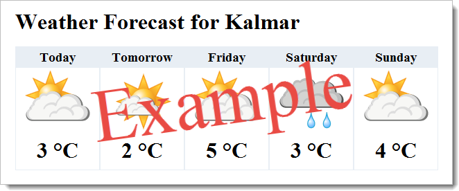

# 2.1 Individuellt arbete #

----------

- *Uppgift*:
[2-1-individuellt_arbete.pdf](https://github.com/1dv409/kursmaterial/raw/master/Laborationsuppgifter/2-1-individuellt-arbete.pdf)

- **2014-12-09 12:00** : *OBS! Detta gäller bara om du väljer att inte göra den föreslagna väderapplikationen. Senaste tidpunkten för inlämning av kort beskrivning av det individuella arbetet.*

- **2015-01-13 12:00** : Senaste tidpunkten för publicering på kursens webbhotell av den webbapplikation du muntligen redovisar under torsdagen den 15 januari 2015 eller fredagen den 16 januari 2015.
 
- **2015-01-15 – 2015-01-16** : Individuell muntlig examination av det individuella arbetet.

----------

"Du är fri att skapa och utforma vilken webbapplikation du vill. Du ansvarar för att se till att din applikation uppfyller de krav kursledningen ställer på den beträffande grundläggande tekniker och funktionalitet. Avvikelser från kraven måste dokumenteras och godkännas av kursledningen innan du kan bortse från ett eller flera av dem."

"Applikationen ska arbeta med data från minst två datakällor, vara av en måste vara en databas. En databas med minst en tabell och hämtning av data från minst en webbservice anses uppfylla kravet på två datakällor."

